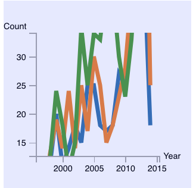

## Vis-Project-fall-2018
> Vanderbilt *CS3891* *Introduction to Visualization* Final Project, fall 2018

### Description

---
Using the [UFO Sighting data](https://www.kaggle.com/NUFORC/ufo-sightings) from [National UFO Reporting Center](http://www.nuforc.org/), which reports unidentified flying object over the last century, we aims to investigate questions such as where or when most UFO sightseeing occurs, identify patterns or correlations across *geo* and *time* information, and, possibly, derives some mysterious theories related to extra-terrestrials. We would also consider the *shape* and appeared *duration* of the alien reported. An interesting data attribute would be the detailed *comment* of each report, which would help us gain better insights into the data.

---

### Overview

We used **[d3.js](https://d3js.org/)** mainly to visualize the data and perform related interaction.
File [`documentation`](/documentation) includes the proposal, process book and other related writing files of the project; [`data`](/data) includes related ufo sighting data before cleaning and after cleaning, and also the python script used to clean up the data; [`webpage`](/webpage) contains the javascript and css codes (also the us-geo.json used for geometric visualization, which is the backbone of our project; and `index.html` is the entry to the visualization and interaction.

### Running

The data visualization is accessed through the broswer. To run, cloning the entire project and run `python -m SimpleHTTPServer` in the console in the root directory of the project. Then, go to the following url: [http://localhost:8000/](http://localhost:8000/) would load the visualization.
---
## Process Book

### Exploratory Data Analysis

**Stage 1**: We used a USA geo-map to visually look at our data since it has *latitude* and *longitude* attribute. By looking at the distribution of data on the map, we found that in general, eastern states have more reports compared with western states. However, California has the most reported counts.

**Stage 2**: Since the dataset contains attributes such as reported date, UFO shape or sighting duration, but our current geo-map visualization does not include this, we wanted to add some other views to our visualization. Eventually we chose line chart for displaying reported year information for selected states, bar chart for visualizing UFO shape and duration for selected states. By examining these charts, we found:

- Most reports appeared after 2000. One possible guess is that with the advent of various kinds of digital devices and social media, it becomes easier for spotters to report their sightseeing. 
- Most UFO shapes reported are just light. We propose that it might be caused by the factor that light is the easiest to describe during report when the spotter cannot really see the actual shape, or they might just mistake any bright flying object such as airplanes, satellites, comets for UFO. 
- Most sighting duration are only a few to a hundred or so seconds. It is rare to see a report even more than 10 mins (600 seconds). So we speculate that these UFO might move pretty fast. Or if the UFO is stationary, the time is probably too short for the spotter to go closer to take a look.

**Update**: We enabled multiple states being selected to be added to subplots. This made comparison between states possible. By analyzing statistics among different states, we found *California* seems to be a favored place for UFO visiting. Its visualization on either year line chart, or shape bar chart and duration bar chart are significant outnumbers any other states.

**Stages 3**: By exploring our current visualization, we can find that different states have very different UFO report distribution, both in spatial space and some other aspects. We hypothesize that most UFO reported might just be *military planes* that have unusual shapes or lighting patterns. To verify our assumption, we added some major US air force bases to our map. From the visualization we can see that some dense report areas such as southern California, Dallas area, northeastern areas, do have air bases around them so our explanation might be correct.

### Design Evolution

We considered using line chart, bar chart, map, polar area chart, word cloud. We eventually chose *line chart*, *bar chart* and *map*. Because we are presenting geospatial data so the map is the most powerful tool for showing where those report data are. We chose line chart for the reports counts during each year because line chart is a good choice for presenting potential trends, especially with time as one dimension. We chose bar chart for both UFO shapes and durations. UFO shapes are discrete categories and bar chart is good at plotting category data. 

The **color** on the map represents the counts of the states. Here we embraced the concept discussed in class that “Get it right in black and white” so our luminance is decreased as the color becomes lighter. Also, the states’ color are chose intentionally to be a different hue than the background light blue so it stands out. While we are still keeping the similar hue for the states so it is consistent. 

For **interaction**, we provided the user with an overview of the whole U.S map and the user can zoom in to see details on demand. We also have some buttons as scented widgets so the users can choose to see data from certain years or has certain shapes.

### Analysis

Please also refer to the answers to question 1 for what we learnt from the data. We found both the geospatial patterns and year trend, shape spotted trend in our visualization. I think our visualization is great in presenting both geospatial attribute, year attribute, shape attribute and duration attribute. However, if we had time to implement **word cloud** in each state for the comments of the reports, some more interesting insights might be seen.

### Overview and Motivation

This project is about visualizing UFO sighting report. It aims at finding some potential trends, patterns or interesting facts behind UFO sightseeing. The initial motivation was from the mysterious nature of UFO. Since not much has been known to UFO and it remains a debating topic, we thought maybe visualization might serve as a good tool to enable us to further investigating it, rather than using some traditional mathematical analysis.

### Related Work

We found some d3.js online examples really useful. 
Here are the references we used for plotting the map data,
- http://bl.ocks.org/michellechandra/0b2ce4923dc9b5809922
- https://bl.ocks.org/mbostock/4090848
- https://gist.github.com/NPashaP/a74faf20b492ad377312

For the implementation of the tooltip, we find visualization in this link helpful,
- http://bl.ocks.org/NPashaP/a74faf20b492ad377312

The assignment 2 that visualizes different time plots across different music categories and the design choices made using of stacked bar charts in assignment 4 inspires the subplots of our main view.

Furthermore, here are some discussions of the dataset from Kaggle, which may also influence our design choice: 
- https://www.kaggle.com/tanyavas/ufo-analysis-x-files/notebook
- https://www.kaggle.com/abigaillarion/ufo-reports-in-united-states/notebook
- https://www.kaggle.com/NUFORC/ufo-sightings/discussion

For the design and layout of the five Sheet Methodology in our proposal, we use http://fds.design/index for reference.

### Questions

In our proposal, we outlined four main questions: 
- what areas of the state or country are most likely to have UFO sightings? 
- Are there any trends in UFO sightings over time? 
- Do they tend to be clustered or seasonal?
- Do clusters of UFO sightings correlate with landmarks, such as airports or government research centers? What are the most common UFO descriptions?

Over time, we are more focused on the trend based on year, shape and duration by different states. We end up not process text from description although it’s a great source to visualize and analyze. We also didn’t dig into the seasonality of our data set, which may include interesting insights.

However, to investigate the potential correlation between government landmarks and our data, we introduced new data set consisted of geometric attributes (longitude, latitude) of some randomly chosen U.S. Air Force Bases.

### Data

**[Source](https://www.kaggle.com/NUFORC/ufo-sightings)**: (Link to the Kaggle Dataset) The data contains over 80, 000 reports of UFO sightings over the last century from 1910 to 2014. Since the reports date back to the early 20th century, some older data might be obscured. Data contains city, state, time, description, and duration of each sighting.

The dataset is originated from The [National UFO Reporting Center (NUFORC)](http://www.nuforc.org/), a non-profit corporation located in Seattle, Washington, which corroborates and documents from individuals who have been witness to unusual, possibly UFO-related events.

**Scraping method**
The main scraping was done by [Sigmond Axel on his github project](https://www.kaggle.com/NUFORC/ufo-sightings). He took the data from NUFORC, which was further scraped, geo-located, and time standardized. He filtered out data that has erroneous or blank time (8.0237%). He also standardized duration time in the unit second. 

**Clean up & Data Processing**
In the Python Script, we translated the states attributes of the data items to full state name instead of abbreviation in order to coordinate with the geo projector. Moreover, we only kept the attribute year (split from time attribute in the original data), state, country, shape, duration, latitude, and longitude. We further filter out items with no state. items without U.S., and items without shape specified.

### Implementation

**Interaction: “Overview first”**
 
Main viewport includes a sequential color map that represents the total count of data items in each state. (Corresponding legend is on the lower right part of the main view)

Interactively hovering across state would also display aggregated relevant year, shape, duration sub plots on the right.
By clicking the button “Show Report Map”, the individuals would be displayed in the main view based on its geometric attributes. By clicking the button “Show Air Bases” for comparison, the corresponding air force bases in our data set would also appear on the plot. By clicking them again, individual points would disappear and the main view would back to the original view.

 

**Interaction: “zoom and filter”**
In the detailed circles mode, we have filter condition “Light”, “Triangle”, “Circle” (the three most reported shapes) to filter the data items by attribute shape, and year “1910 – 1980”, “1981 – 2005”, “2006 – 2014” to filter the data items by time. 
We also enabled zooming on the main viewport to get detailed view.

 

**Interaction: “details-on-demand”**
In the main viewport, hovering above a state would enable small tooltip that represent the numeric count value of that state. 

Furthermore, by clicking on each state, comparison among states is presented. Max displayed state number would be 3. After the third click, further click would pop up the earliest selection of the state. “Reset Subplot” button would clean the current stack and change the view back to hover mode.
The axes in the timeplot is also zoomable.

 

**Some Limitation**
- We aggregate the data to state level, but we can narrow it further down to city information. 
- the viewport could be more interactive. The interaction between main view and sub plot could include brushing and filtering (linking) based on the attribute in the subplot. 
- Air force bases could include more samples. 
- The plot could apply more effective color channel besides linear interpolation. 
- Area or population of a state could be considered when we visualize the count. 
- The plot could contain more information in the tooltip. 
- Last but not least, we could apply data kernel density estimation to mitigate cluster.
