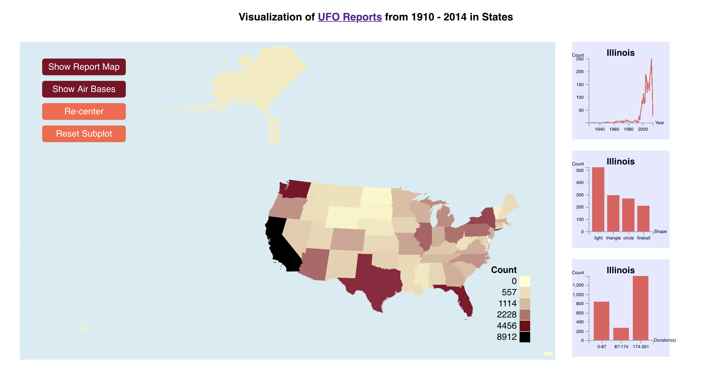
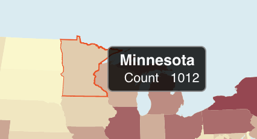
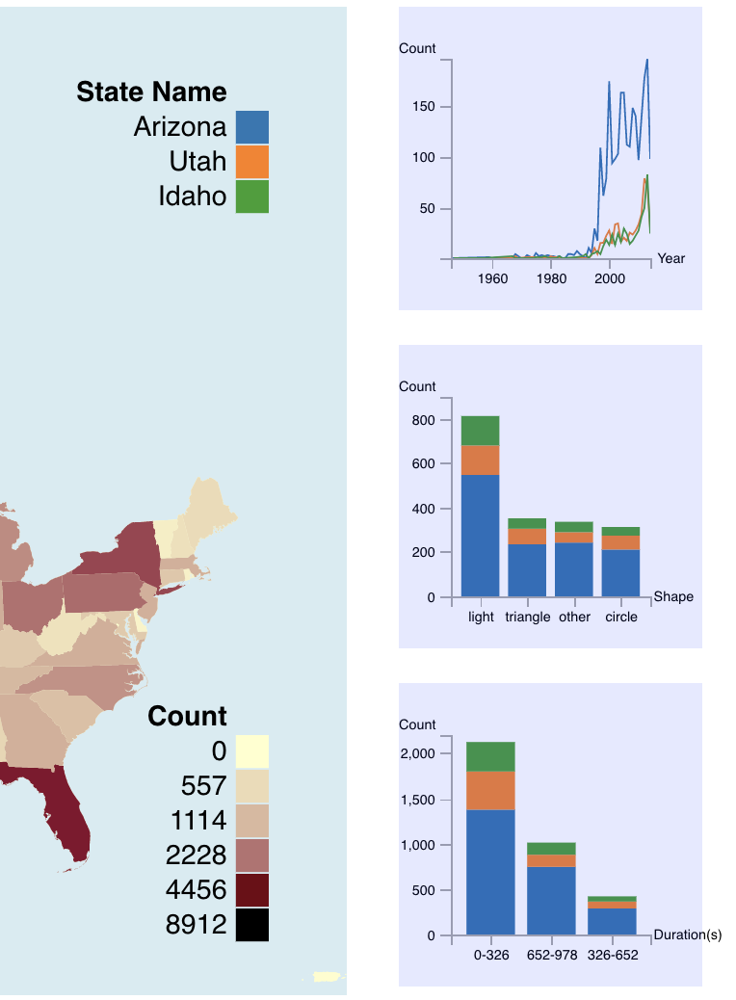
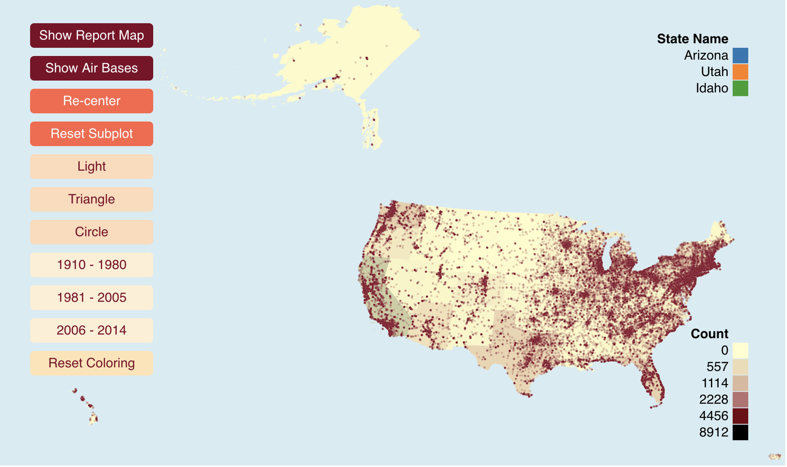
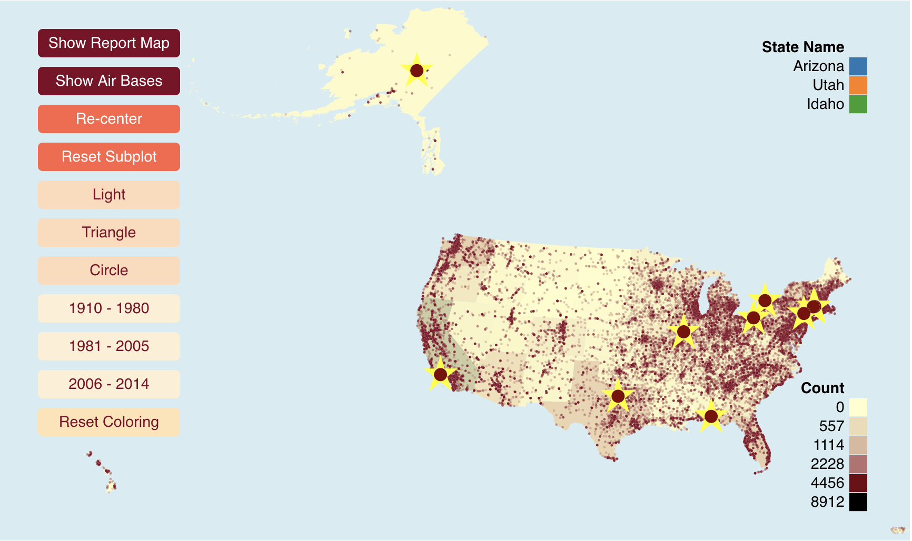

## Vis-Project-fall-2018
For Vanderbilt Vis Final Project, fall 2018

#### Description 

---
Using the [UFO Sightseeing data](https://www.kaggle.com/NUFORC/ufo-sightings) from [National UFO Reporting Center](http://www.nuforc.org/), which reports unidentified flying object over the last century, we aims to investigate questions such as where or when most UFO sightseeing occurs, identify patterns or correlations across *geo* and *time* information, and, possibly, derives some mysterious theories related to extra-terrestrials. We would also consider the *shape* and appeared *duration* of the alien reported. An interesting data attribute would be the detailed *comment* of eac
h report, which would help us gain better insights into the data.

---

#### Specification

We used d3.js mainly to visualize the data and perform related interaction.
File `documentation` includes the proposal, process book and other related writing files of the project; `data` includes related ufo sighting data before cleaning and after cleaning, and also the python script used to clean up the data; `webpage` contains the javascript and css codes (also the us-geo.json used for geometric visualization, which is the backbone of our project; and `index.html` is the entry to the visualization and interaction.

#### Running

The data visualization is accessed through the broswer. To run, cloning the entire project and run `python -m SimpleHTTPServer` in the console in the root directory of the project. Then, go to the following url: [http://localhost:8000/](http://localhost:8000/) would load the visualization.

#### Illustration
- Main view
    - 
- Tooltip
    - Hovering onto states would display the counts of all data items in the tooltip
    - Hovering onto states would also display subplot based on time, shape, duration on the right based of current hovering state
    - 
- Sub plots
    - When clicking on individual states, a max number of 3 states's info would display on the subplots
    - Can click the button `reset clicking` to change back to hover mode
    - 
- Detailed View of Individual Instances
    - after clicking `Show Report Map`
    - 
- Map to Air Bases 
    - after clicking `Show Air Bases`
    - 
- Sub Selection based on time and shape
    - Click shallow colored button on the left would fiter out specific data based on the selection
    - 

